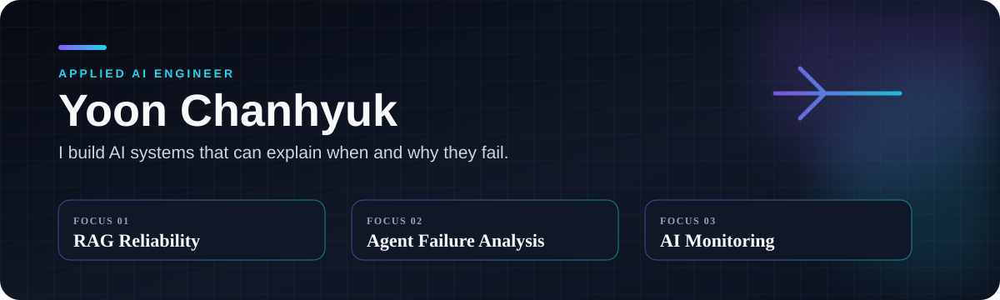

### AI evaluation, failure localization, monitoring

서울과학기술대학교 교통공학 전공 · AI/ML Engineer

[Portfolio](https://yoon-chan-hyeok.github.io/) · [RAG](https://github.com/yoon-chan-hyeok/temporal-rag-drift) · [Multi-Agent](https://github.com/yoon-chan-hyeok/multi-agent-failure-localization) · [OCR](https://github.com/yoon-chan-hyeok/ocr-quality-monitoring)

모델을 연결하는 데서 끝내지 않고, 데이터나 실행 조건이 바뀐 뒤 시스템이 어디서 무너지는지 측정합니다. 현재 작업은 RAG update monitoring, multi-agent trace localization, label-free OCR monitoring에 집중되어 있습니다.

## Selected work

| Project | Technical scope | Public evidence |
|---|---|---|
| [Temporal RAG Drift](https://github.com/yoon-chan-hyeok/temporal-rag-drift) | DB 업데이트 이후 새로 발생한 RAG 성능 저하를 label-free하게 모니터링하고, 탐지 사례에 intervention-based probing을 적용해 failure mechanism 후보를 좁히는 프레임워크 | Frozen temporal transfer 결과, P1-P5 probe, 실행 코드, 테스트 |
| [TSR-Loc](https://github.com/yoon-chan-hyeok/multi-agent-failure-localization) | Task-only requirements를 고정한 뒤 multi-agent trace에서 final failure로 이어진 earliest unrecovered error를 agent·step 수준에서 localization | Who&When 184 trajectories 평가, baseline 비교, paired test, CI |
| [OCR Quality Monitor](https://github.com/yoon-chan-hyeok/ocr-quality-monitoring) | OCR embedding의 record-level anomaly와 batch-level distribution shift를 결합해 review queue를 생성 | Installable CLI, deterministic fixture, tests, CI |
| [Face Attendance System](https://github.com/yoon-chan-hyeok/face-attendance-system) | RetinaFace·ArcFace 인식을 multi-frame enrollment, ambiguity rejection, FastAPI·MariaDB·React workflow로 연결 | Architecture와 decision rule을 공개한 engineering case study |
| [Event Traffic Delay](https://github.com/yoon-chan-hyeok/event-traffic-delay-analysis) | OD·생활인구·버스·GIS 분석을 hub·capacity·cost constraint가 있는 shuttle operating scenario로 변환 | 집계 결과와 운영 가정이 공개된 transportation decision case study |

## Technical focus

| Area | Methods and tools |
|---|---|
| Evaluation | temporal split, frozen transfer, baseline and ablation, paired significance test |
| Reliability | distribution drift, semantic uncertainty, exact-step attribution, intervention probe |
| AI systems | retrieval, embeddings, NLI, model backends, computer vision |
| Delivery | Python, FastAPI, SQLAlchemy, MariaDB, React, TypeScript, CLI, CI |
| Data analysis | EDA, GIS, multi-source joins, scenario and capacity modeling |

## Repository scope

RAG, multi-agent, OCR 저장소는 실행 코드와 테스트를 포함합니다. 얼굴 출결은 생체정보와 원본 운영 환경을, 교통 분석은 원천 데이터 재배포 제약을 고려해 case study 형태로 공개했습니다. 각 README에는 재현 가능한 범위와 결과 해석의 한계를 따로 적었습니다.

