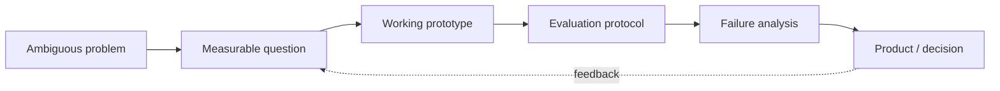

### AI를 “동작하게” 만드는 데서 끝내지 않고, 실패를 측정하고 설명합니다.

서울시립대학교 교통공학 × 인공지능  
**RAG Reliability · Multi-Agent Evaluation · AI Monitoring · Data Products**

[프로젝트 보기](#featured-projects) · [검증된 성과](#proof-over-promises) · [기술 역량](#engineering-toolbox)

---

## 30-second snapshot

| | |
|---|---|
| **지향점** | AI/ML Engineer · AI Reliability · Applied AI |
| **강점** | 문제 정의 → 프로토타입 → 평가 설계 → 실패 분석 → 문서화 |
| **대표 작업** | 업데이트 후 나빠진 RAG 질문 탐지 · 멀티에이전트 실패 지점 추적 · OCR 검수 자동화 |
| **작업 방식** | 빠르게 구현하고, 테스트와 반복 실행으로 결과를 확인 |
| **도메인 연결** | AI 연구 문제를 웹·DB·CLI·교통 운영 의사결정까지 확장 |

## 한눈에 보는 작업

<table>
<tr>
<td width="25%" align="center"><h3>RAG 변화 감지</h3>업데이트 뒤 나빠진 질문을 먼저 찾기</td>
<td width="25%" align="center"><h3>실패 지점 추적</h3>여러 에이전트 중 누가 언제 틀렸는지</td>
<td width="25%" align="center"><h3>OCR 검수 자동화</h3>사람이 먼저 볼 결과를 정렬</td>
<td width="25%" align="center"><h3>5개 프로젝트</h3>AI · 제품 · 데이터 운영 문제 해결</td>
</tr>
</table>

> 자세한 수치와 평가 방법은 각 프로젝트의 결과 섹션에서 확인할 수 있습니다.

## Featured Projects

<table>
<tr>
<td width="50%" valign="top">
<h3><a href="https://github.com/yoon-chan-hyeok/temporal-rag-drift">01 · Temporal RAG Drift</a></h3>

<strong>지식 업데이트 뒤 새로 망가진 질문을 어떻게 찾을까?</strong>

누적 뉴스 스냅샷 간 답변 분포 이동과 불확실성을 이용해 품질 저하 위험을 탐지했습니다.

<code>문제 질문 10개 중 약 7개 탐지</code> · <code>16개 테스트</code>

Python · RAG Evaluation · Embeddings · NLI · Statistical Testing

</td>
<td width="50%" valign="top">
<h3><a href="https://github.com/yoon-chan-hyeok/multi-agent-failure-localization">02 · Multi-Agent Failure Localization</a></h3>

<strong>여러 에이전트 중 누가, 정확히 언제 실패했을까?</strong>

작업 요구조건을 먼저 고정하고 긴 trace에서 가장 이른 미복구 오류를 찾는 TSR-Loc을 평가했습니다.

<code>184건 반복 평가</code> · <code>100건 중 약 39건에서 정확한 실패 지점 확인</code>

LLM Evaluation · Trace Analysis · Experiment Harness · CI

</td>
</tr>
<tr>
<td width="50%" valign="top">
<h3><a href="https://github.com/yoon-chan-hyeok/ocr-quality-monitoring">03 · Label-Free OCR Monitor</a></h3>

<strong>정답 라벨이 늦게 오는 운영 환경에서 무엇을 먼저 검수할까?</strong>

평소와 다른 OCR 결과를 찾아 사람이 먼저 검수할 순서로 정리했습니다.

<code>정답 없이 시작</code> · <code>한 줄 실행</code> · <code>자동 테스트</code>

AI Monitoring · Data Drift · MMD · Python Packaging

</td>
<td width="50%" valign="top">
<h3><a href="https://github.com/yoon-chan-hyeok/face-attendance-system">04 · Face Attendance System</a></h3>

<strong>얼굴 인식 결과를 실제 출결 흐름까지 어떻게 연결할까?</strong>

여러 장 등록, 흐린 얼굴 차단, 애매한 판정 보류를 출결 관리 화면까지 연결했습니다.

<code>여러 장 등록</code> · <code>모호한 판정 보류</code> · <code>관리 화면</code>

Computer Vision · FastAPI · MariaDB · React

</td>
</tr>
<tr>
<td width="50%" valign="top">
<h3><a href="https://github.com/yoon-chan-hyeok/event-traffic-delay-analysis">05 · Event Traffic Delay</a></h3>

<strong>대형 행사 혼잡 분석을 실행 가능한 운영안으로 바꿀 수 있을까?</strong>

이동·생활인구·버스·공간 데이터를 결합해 세 방향으로 혼잡을 나누는 셔틀 운영안을 설계했습니다.

<code>3개 환승 거점</code> · <code>반복 운행</code> · <code>비용 산정</code>

Mobility Data · EDA · GIS · Scenario Planning

</td>
<td width="50%" valign="top">
<h3>What connects them?</h3>

<strong>모델 점수보다 의사결정 가능한 증거를 만듭니다.</strong>

변화를 감지하고, 실패 위치를 설명하고, 사람이 검토할 순서를 만들며, 결과를 제품과 운영 흐름에 연결합니다.

<code>Measure</code> → <code>Diagnose</code> → <code>Decide</code>

</td>
</tr>
</table>

## Engineering through-line

## Capability map

| 역량 | 실제로 한 일 | 확인할 프로젝트 |
|---|---|---|
| **AI 평가 설계** | temporal split, frozen transfer, baseline·ablation, paired significance | RAG · Multi-Agent |
| **AI 시스템 구현** | embeddings, retrieval, model backends, CLI, API·DB·UI 연결 | RAG · OCR · Face |
| **실패 분석** | drift risk, exact-step attribution, intervention probe | RAG · Multi-Agent |
| **데이터 의사결정** | 다중 데이터 결합, 시나리오·용량·비용 산정 | Traffic |
| **재현성** | 합성 fixture, 자동 테스트, CI, 결과표, claim boundary | RAG · Multi-Agent · OCR |

## Engineering toolbox

**AI & Research**  
RAG Evaluation · Embeddings · LLM-as-a-Judge · Computer Vision · Experimental Design · Statistical Testing

**Data & Delivery**  
EDA · GIS · Reproducible Experiments · API Design · Relational Data Modeling · CI

## How I build

### Define → Build → Measure → Diagnose → Improve

1. 모호한 요구를 평가 가능한 질문으로 바꿉니다.
2. 빠르게 동작하는 end-to-end 경로를 만듭니다.
3. baseline과 실패 기준을 정하고 수치로 비교합니다.
4. 평균 성능 뒤의 실패 사례와 불확실성을 찾습니다.
5. 코드·테스트·문서·한계를 함께 남깁니다.

## Working style

도구는 빠르게 활용하되 결과는 직접 확인합니다. 문제 정의, 비교 기준, 결과 해석과 공개 범위까지 한 프로젝트의 책임으로 봅니다.

---

### 좋은 AI는 높은 점수만 내는 시스템이 아니라, 실패를 발견하고 설명할 수 있는 시스템이라고 생각합니다.

[GitHub에서 작업 보기](https://github.com/yoon-chan-hyeok)

